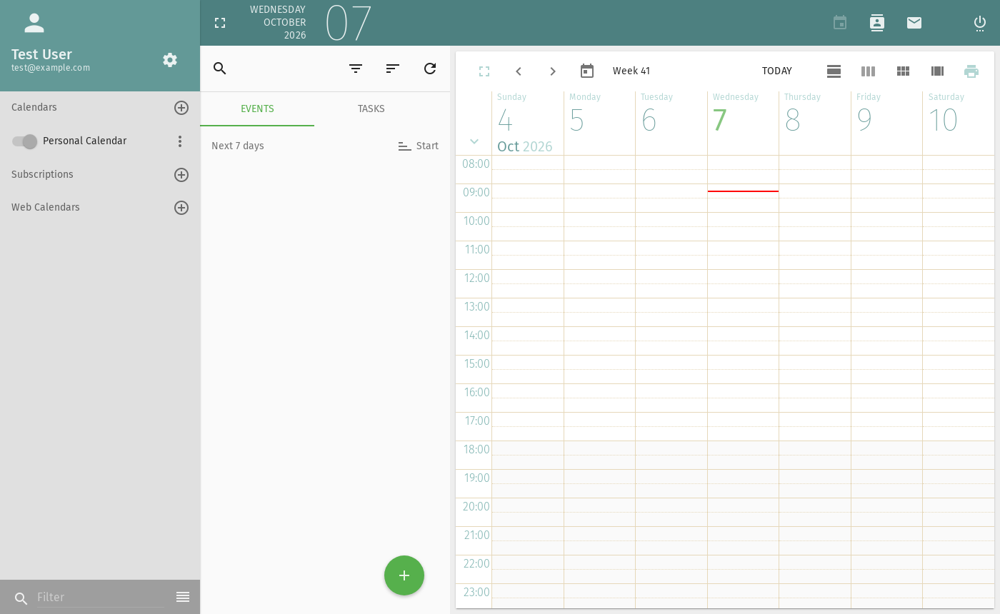
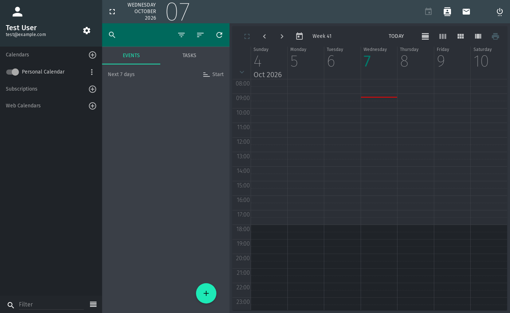
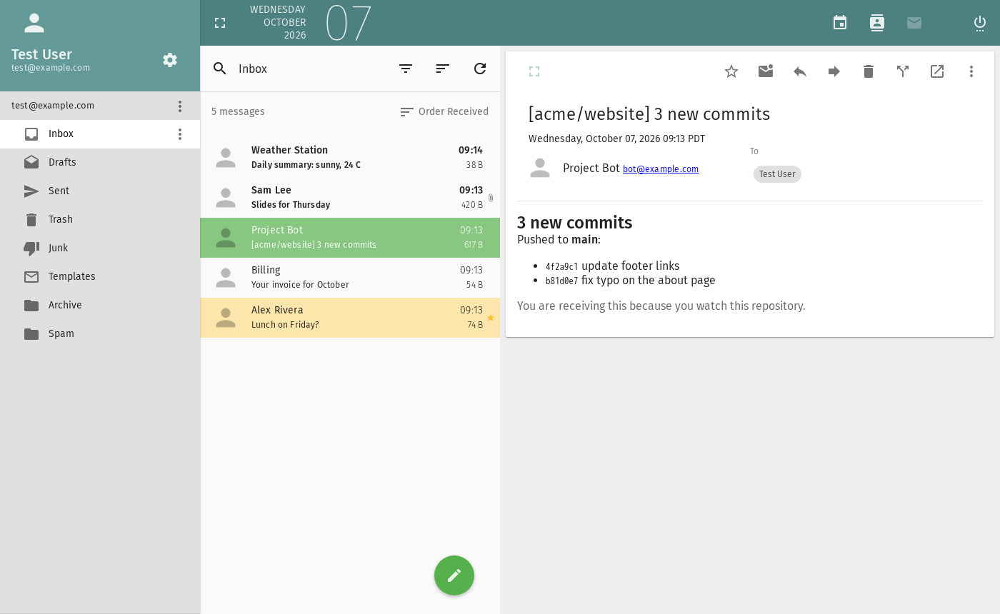
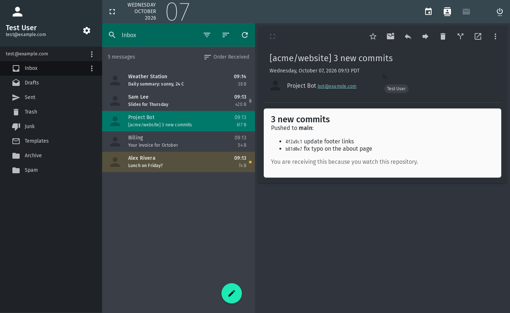
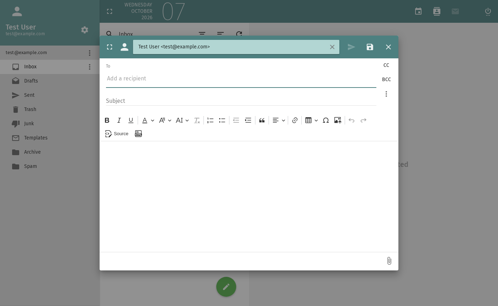
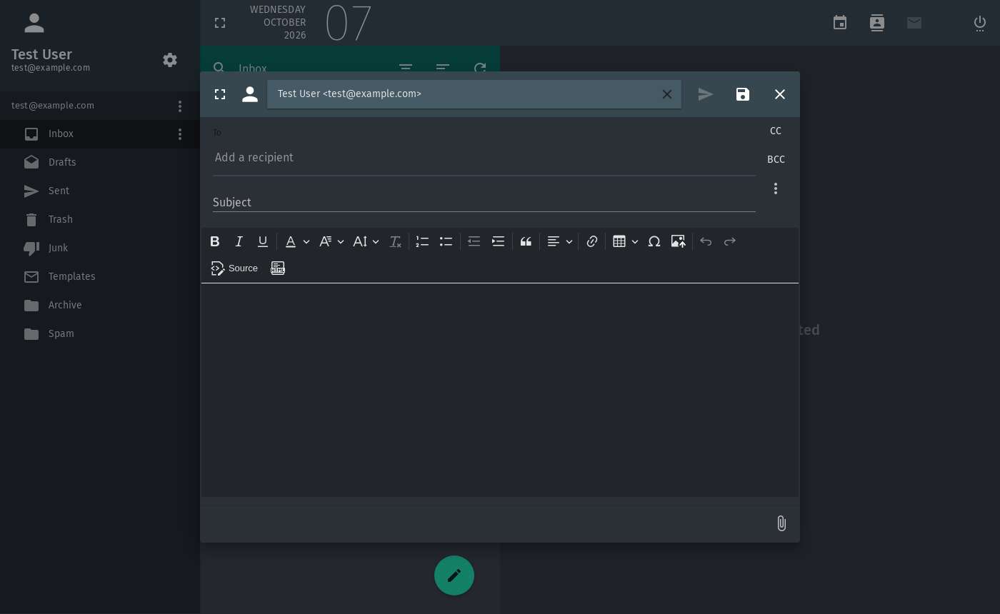

# sogo-dark

A light / dark / auto theme for the [SOGo](https://www.sogo.nu/) web interface. It's two files that drop into a stock SOGo, with no rebuild.

| Light (stock SOGo) | Dark |
|---|---|
|  |  |
|  |  |
|  |  |

More views (contacts, preferences, login, plain-text mail) are in [`docs/screenshots`](docs/screenshots).

## What it does

- **Auto by default:** the browser's `prefers-color-scheme` decides when the page loads. On a light system you get stock SOGo, unchanged.
- **Theme setting in Preferences → General:** Auto (follow system), Light or Dark. The choice is saved in the browser (`localStorage["sogo-theme"]`), so it is per browser rather than per user. It applies on the next page load, and a **Reload now** button appears after a change. sogo-dark never reloads by itself, because the Preferences page can hold other unsaved changes; for the same reason, a system theme switch also waits for the next load.
- **Dark theme:** a dark Angular Material theme, plus about 20 CSS rules for the colors SOGo hardcodes instead of taking from the theme. These include the calendar grid, off-hours and grid lines, the login page, flagged and selected mail rows, chips, links, the compose dialog and the CKEditor toolbar.
- **Remembers Expand per module:** SOGo's toolbar Expand button (top left, hides the folder list) resets on every page load. sogo-dark remembers it separately for Mail, Calendar and Contacts (`localStorage["sogo-expand-<module>"]`), on wide screens only. Turn it off in **Preferences → General → Expanded view**. The Expand button above an open message or contact is left alone.
- **HTML mail** is shown on a light "paper" card inside the dark reading pane, because most HTML mail is designed for a white page. Plain-text mail stays dark.

Tested with **SOGo 5.12.7** (Debian/Ubuntu packages, in the `pmietlicki/sogo` image) in Chromium. Other versions may need selector updates.

## Install

1. Copy the files into SOGo's web resources. On Debian/Ubuntu packages that's `/usr/lib/GNUstep/SOGo/WebServerResources/`; other builds may use `lib64` or another prefix.
   - `js/sogo-dark.js` → `WebServerResources/js/sogo-dark.js`
   - `css/sogo-dark.css` → `WebServerResources/css/sogo-dark.css`

   In Docker, bind-mount them instead (see [`examples/compose.yaml`](examples/compose.yaml)). SOGo's own `js/theme.js` is left alone, so package upgrades don't remove sogo-dark (but recheck it after a SOGo upgrade).
2. Add to `sogo.conf` (see [`examples/sogo.conf.snippet`](examples/sogo.conf.snippet)):
   ```
   SOGoUIxDebugEnabled = YES;
   SOGoUIAdditionalJSFiles = ("js/sogo-dark.js");
   ```
3. Restart `sogod` and reload the page.

## How it works, and its limits

- SOGo normally serves a precompiled `theme-default.css`. Only with `SOGoUIxDebugEnabled = YES` does it build the theme at runtime, which lets `sogo-dark.js` register a dark theme. This is the workaround described in [Mantis #4500](https://bugs.sogo.nu/view.php?id=4500). Debug mode may change other behavior in SOGo's JavaScript; we haven't measured that.
- SOGo has `SOGoUIAdditionalJSFiles` but no setting for extra stylesheets, so `sogo-dark.js` adds `sogo-dark.css` itself, and only in dark mode.
- The CSS overrides target SOGo's markup and class names, so a SOGo upgrade can break individual rules. Each rule says what it covers.
- The Theme field is added to SOGo's Preferences page by script. If a SOGo upgrade changes that page, the field may not appear, but the theme still follows the saved choice or the system.
- Not covered yet: printing, the mobile layout, some dialogs we haven't opened (for example ACL and event editors), and browsers other than Chromium.

## Upstream

The better fix belongs in SOGo itself. We plan to propose:

1. A `SOGoUIAdditionalCSSFiles` setting, the stylesheet counterpart of `SOGoUIAdditionalJSFiles`.
2. Replacing hardcoded SCSS colors with theme palette references ([Mantis #4500](https://bugs.sogo.nu/view.php?id=4500)). `css/sogo-dark.css` is effectively the list of places.
3. A built-in light / dark / auto preference, stored per user on the server instead of per browser.

If those land, this repo shrinks to a palette.

## License

GPL-2.0, the same as SOGo. See [LICENSE](LICENSE).

Written with Claude Code.
